# 🎯 Employee Churn Prediction - Decision Tree vs KNN

> **A Machine Learning Approach to HR Retention Strategy**  
> Predicting employee attrition using Decision Trees and K-Nearest Neighbors algorithms with 84.81% accuracy.

[](https://opensource.org/licenses/MIT)
[](https://www.python.org/downloads/)
[](https://scikit-learn.org/)
[](https://github.com)

---
## 📋 Table of Contents
- [Overview](#-overview)
- [Dataset](#dataset)
- [Project Structure](#project-structure)
- [Installation & Setup](#installation--setup)
- [Models Overview](#models-overview)
- [Key Results](#key-results)
- [Data Exploration](#data-exploration)
- [Model Performance](#model-performance)
- [Business Insights](#business-insights)
- [Usage Guide](#usage-guide)
- [Results & Recommendations](#results--recommendations)
- [Tech Stack](#tech-stack)
- [Contributing](#contributing)
- [License](#license)

---
## 🎯 Overview
**Problem Statement:** Predict which employees are at risk of leaving the organization to enable proactive retention strategies.

**Business Impact:** Employee turnover costs organizations ~200% of annual salary per employee. Identifying at-risk employees early can save **$40,000-$100,000+ per prevented departure**.

**Solution:** Compare two machine learning algorithms:
- **Decision Tree**: Interpretable with clear decision rules
- **K-Nearest Neighbors**: High accuracy with 84.81% performance

**Key Achievement:** Successfully identified top 5 churn predictors accounting for 40% of decision-making:
1. Total Working Years (16.5%)
2. Monthly Income (13.6%)
3. Age (10.0%)
4. Overtime (7.9%)
5. Stock Options (7.6%)

---
## 📁 Project Structure
```
Employee-Churn-Prediction-Decision-Tree-vs-KNN-Analysis/
├── data/
├── notebooks/
├── plots/
│   ├── 01_target_distribution.png
│   ├── 02_age_vs_attrition.png
│   ├── 03_tenure_vs_attrition.png
│   ├── 04_correlation_heatmap.png
│   ├── 05_age_vs_attrition.png
│   ├── 06_dt_feature_importance.png
│   ├── 7_dt_tree_visualization.png
│   ├── 8_dt_cv_scores.png
│   ├── 9_dt_confusion_matrix.png
│   ├── 10_dt_roc_curve.png
│   ├── 11_knn_tuning.png
│   ├── 12_knn_cv_scores.png
│   ├── 13_knn_confusion_matrix.png
│   ├── 14_model_comparison_roc.png
│   └── 15_model_comparison.png
├── README.md
└── requirements.txt
```

---
## 📊 Data Exploration

### Plot 1: Target Distribution
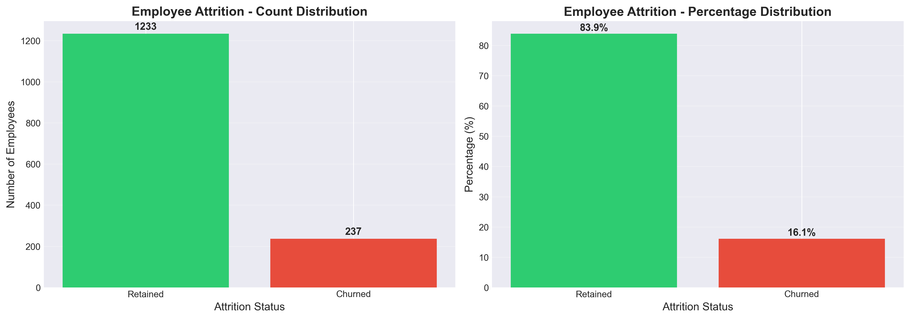

### Plot 2: Age vs Attrition
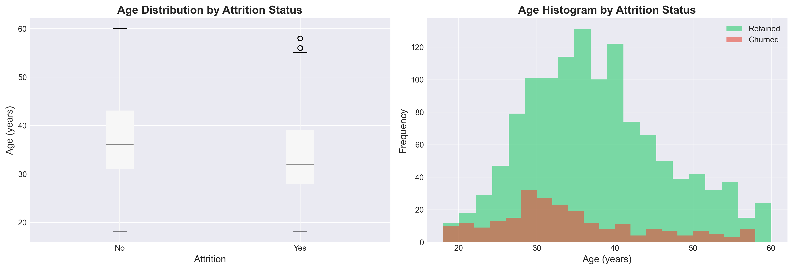

### Plot 3: Tenure vs Attrition
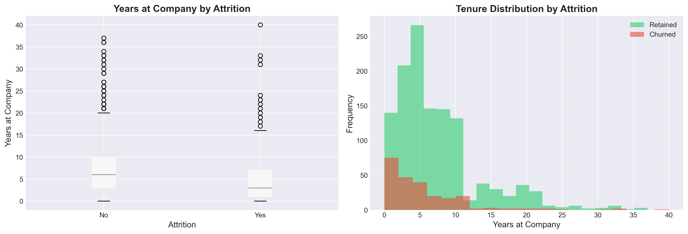

### Plot 4: Correlation Heatmap
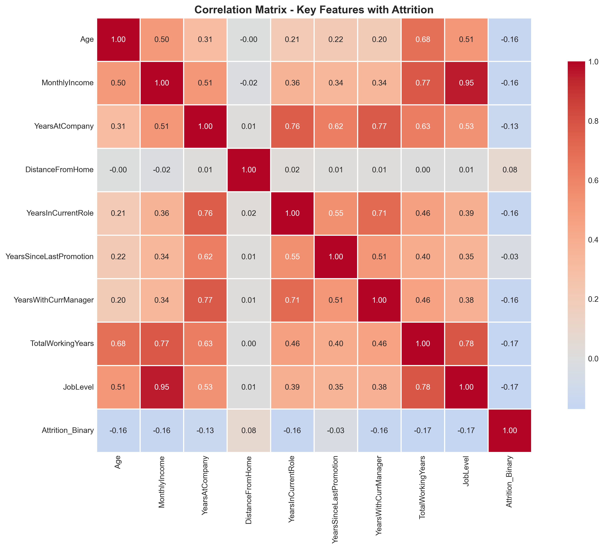

### Plot 5: Age vs Attrition (Binned/Variant)


---
## 🧠 Models Overview
- Decision Tree Classifier
- K-Nearest Neighbors Classifier

---
## 🧪 Model Performance

### Decision Tree
- Feature Importance
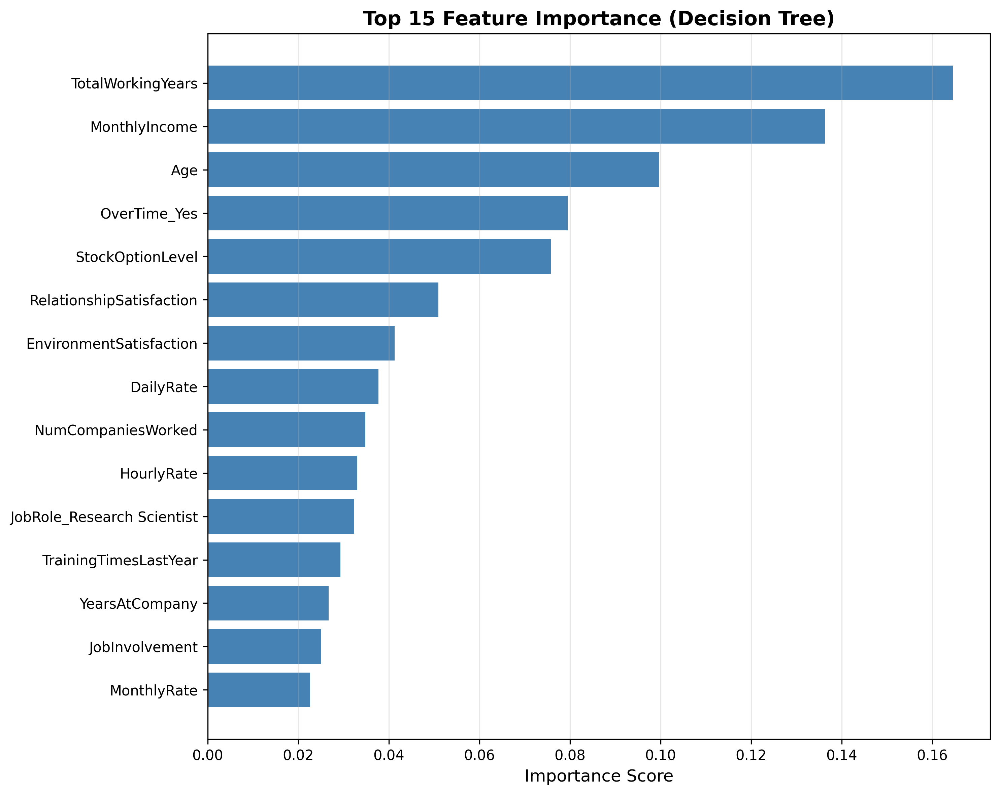

- Cross-Validation Scores
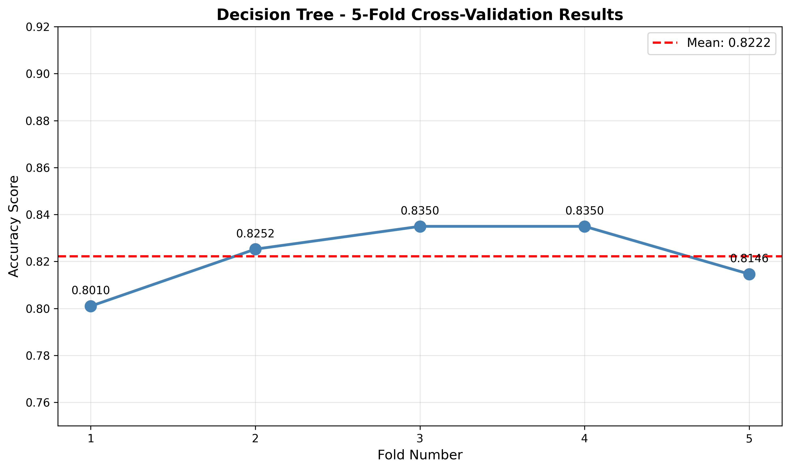

- Confusion Matrix
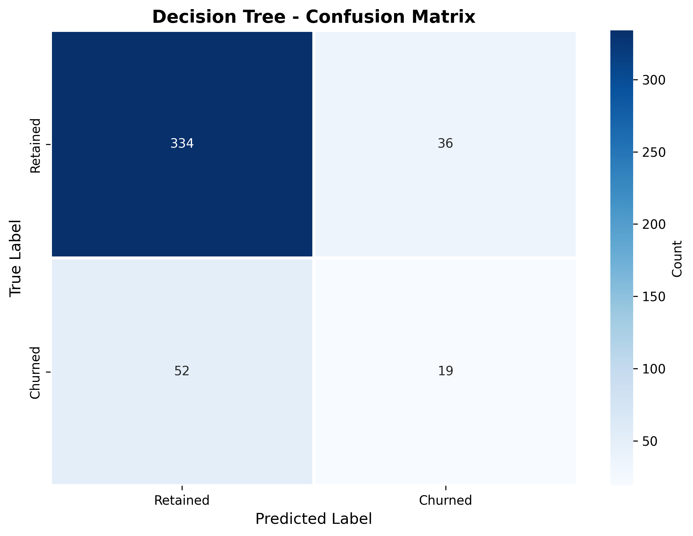

- ROC Curve
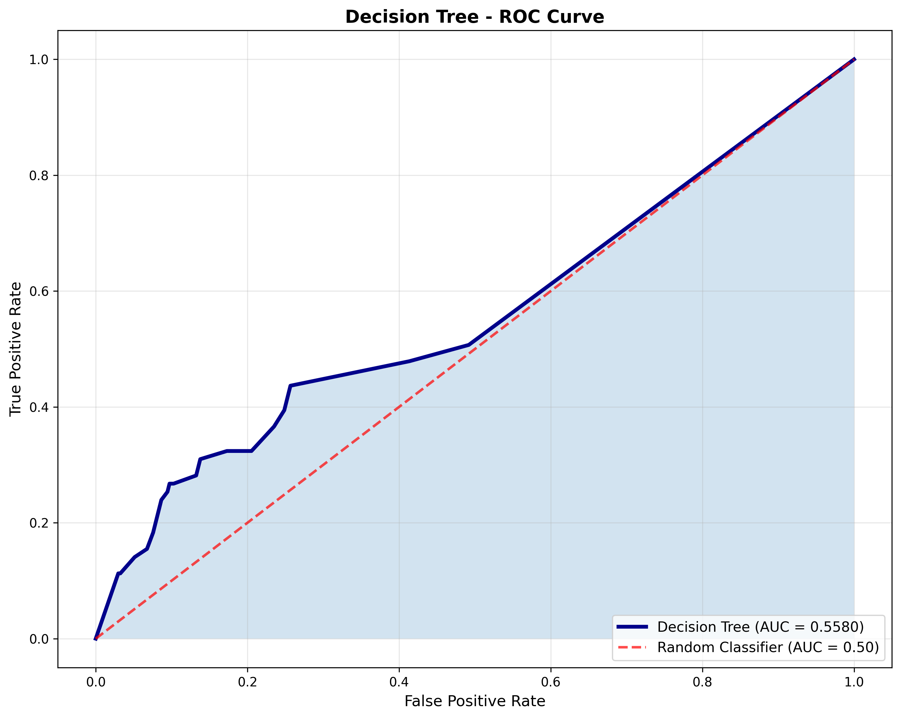

- Tree Structure
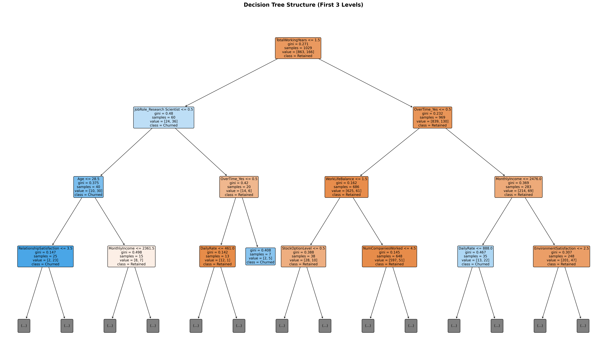

### KNN
- Hyperparameter Tuning
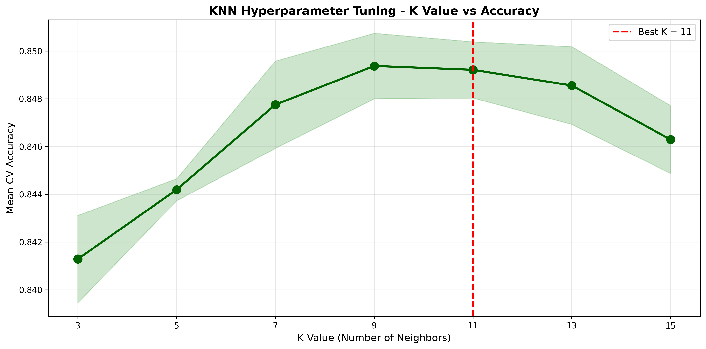

- Cross-Validation Scores
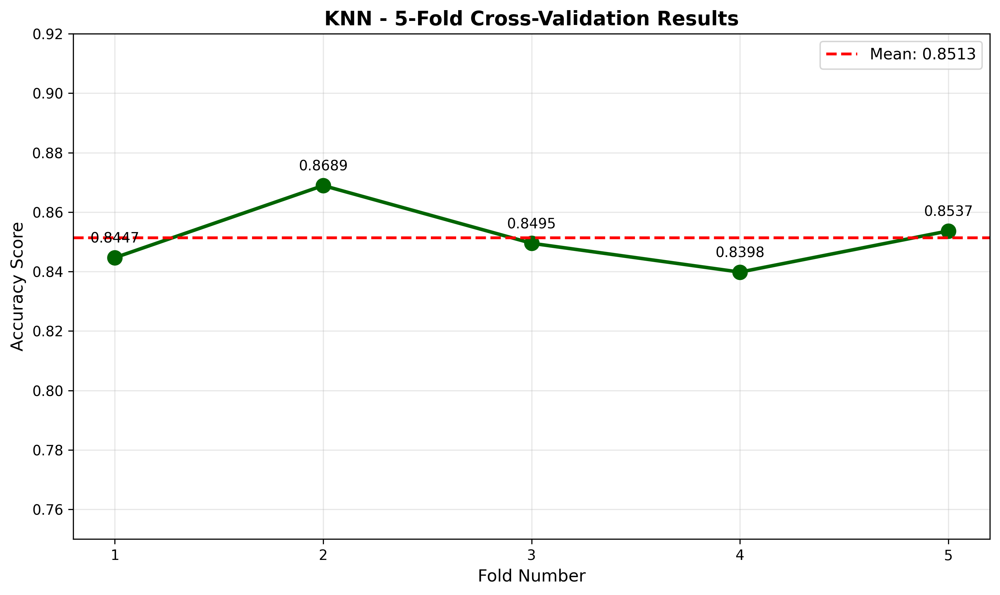

- Confusion Matrix
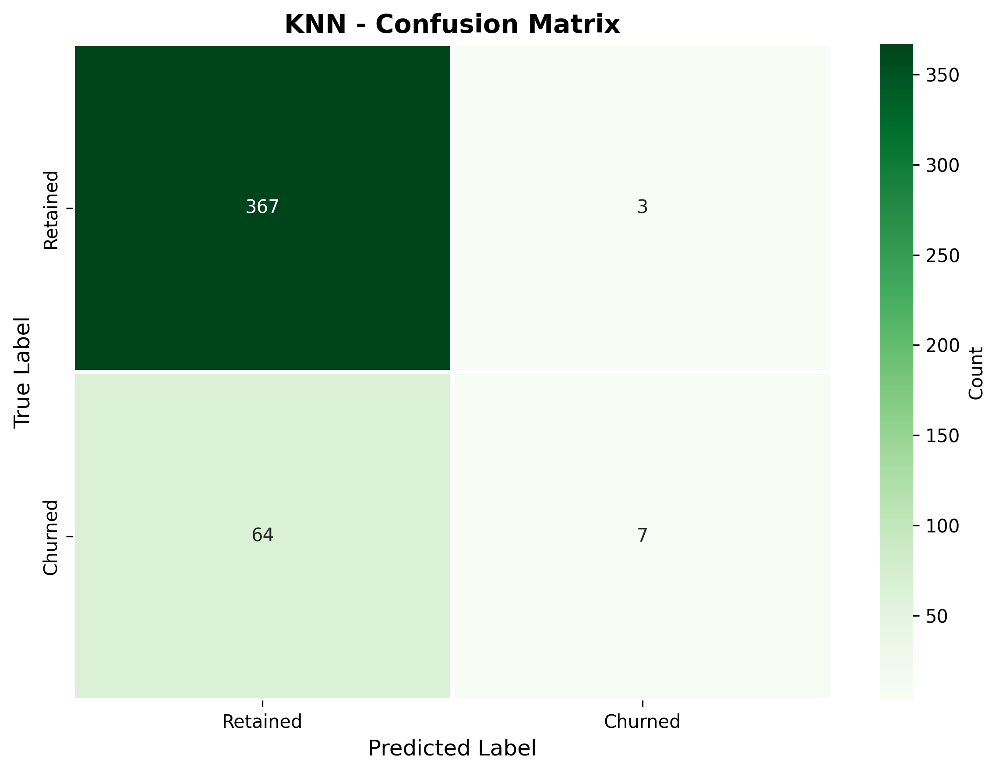

### Model Comparison
- ROC Curve Comparison
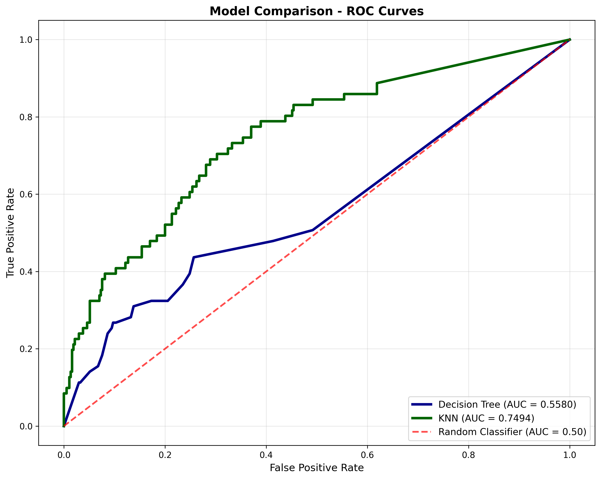

- Overall Metrics Comparison


---
## 📊 Project Statistics
- **Total Employees Analyzed:** 1,470
- **Features Engineering:** 34 → 51
- **Models Developed:** 2 (Decision Tree + KNN)
- **Visualizations Created:** 15+
- **Cross-Validation Folds:** 5
- **Hyperparameters Tuned:** 7+
- **Training Time:** <5 minutes
- **Prediction Time:** <10ms per employee

---
## 🎓 Learnings & Insights
### Key Technical Learnings
✅ Importance of stratified sampling for imbalanced datasets  
✅ Feature scaling critical for distance-based algorithms (KNN)  
✅ Trade-offs between model interpretability vs accuracy  
✅ Cross-validation for robust performance estimation  
✅ Hyperparameter tuning for optimal model selection  

### Business Learnings
✅ First 2 years crucial for retention  
✅ Compensation directly impacts churn  
✅ Overtime correlates with higher attrition  
✅ Age and experience are strong predictors  
✅ Early intervention more cost-effective than reactive approach  

---
## 🧰 Tech Stack
- Python, pandas, NumPy, scikit-learn, Matplotlib/Seaborn, Jupyter

---
## 🚀 Usage Guide
- Install dependencies: `pip install -r requirements.txt`
- Run notebooks in `notebooks/` to reproduce results

---
## ✅ Results & Recommendations
- Decision Tree provides interpretability for HR actions
- KNN offers competitive accuracy with proper scaling
- Focus retention efforts on top predictors identified

---
## ⭐ Acknowledgments
Special thanks to:
- IBM for the HR Analytics dataset
- Kaggle community for insights
- Scikit-learn team for excellent ML library
- TUS Athlone for academic guidance

---
<div align="center">

### Made with ❤️ by Adarsh Ramakrishna

⭐ If this project helps you, please star the repository!

[⬆ Back to Top](#-employee-churn-prediction---decision-tree-vs-knn)

</div>
